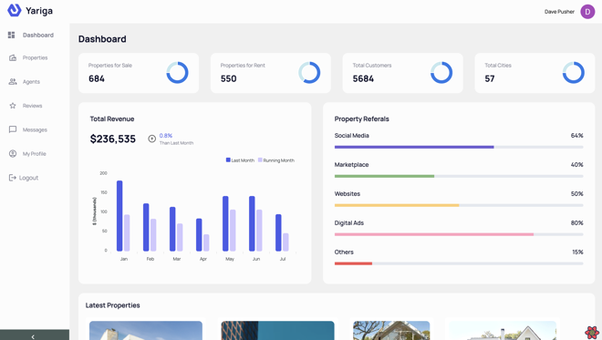

# Refine Properties Dashboard

Project Name
This real estate listing app built with Refine Framework and ReactJS allows users to easily search and view property listings, agents, and reviews. The dashboard feature provides agents with a user-friendly interface to manage their properties and communicate with potential clients. The app offers a variety of search filters and sorting options to help users find their desired property quickly. In addition, users can leave reviews for agents and properties, which helps build trust and transparency within the platform. Overall, the app offers a seamless and efficient experience for both buyers and sellers in the real estate market.



## Table of contents <!-- omit in toc -->

- [Technology Stack](#technology-stack)
- [Getting started](#getting-started)
  - [Installation, build and dev server](#installation-build-and-dev-server)
- [Project Layout](#project-layout)
  - [`server`](#server)
  - [`client`](#client)
- [Vendors](#vendors)
  - [Github](#github)

# Technology Stack

The project is built with the following stack:

Role Technology
|Role|Technology|
|-|-|
|Language|[Typescript]()|
|Frontend|[Refine Framework](https://refine.dev/docs)|
|Components|[Material-UI](https://material-ui.com/)|
|Backend|[Express.js](https://nextjs.org), [Mongoose.js](https://mongoosejs.com), [MongoDB](https://www.mongodb.com)|
|Database|[MongoDB](https://www.mongodb.com)|
|Authenticaton|[AuthProvier](https://refine.dev/docs/api-reference/core/providers/auth-provider/)|

# Getting started

## Installation, build and dev server

To install the dependencies, build and run the dev server, run the following commands:

```
yarn
```

After that, you will need to build various parts of the application:

```
yarn build
```

Finally navigate to the server directory in your terminal and run the following command to start your express server:

```
yarn start
```

The server will start running at `http://localhost:8080`
Then navigate to the client directory in your terminal and run the following command to start your frontend application:

```
yarn dev
```

The app will be available at `http://localhost:3000`

# Project Layout

The app's codebase is structured as follows:

## server

This directory contains the Express server implementation. It is responsible for interacting with the MongoDB database using Mongoose.

## client

This directory contains the Refine Framework implementation of the client-side application. It uses Material UI for styling and TypeScript for type-safety.

## Github

We use [Github](https://github.com) for a code repository
